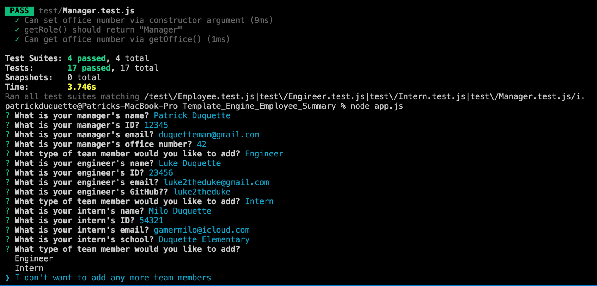

### Template Engine - Employee Summary

As a manager
I want to generate a webpage that displays my team's basic info
so that I have quick access to emails and GitHub profiles.

### User input

The project must prompt the user to build an engineering team. An engineering
team consists of a manager, and any number of engineers and interns.

### Roster output

The project generates a `team.html` page in that displays a formatted team roster. Each team member should display the following in no particular order:

  * Name

  * Role

  * ID

  * Role-specific property (School, link to GitHub profile, or office number)

